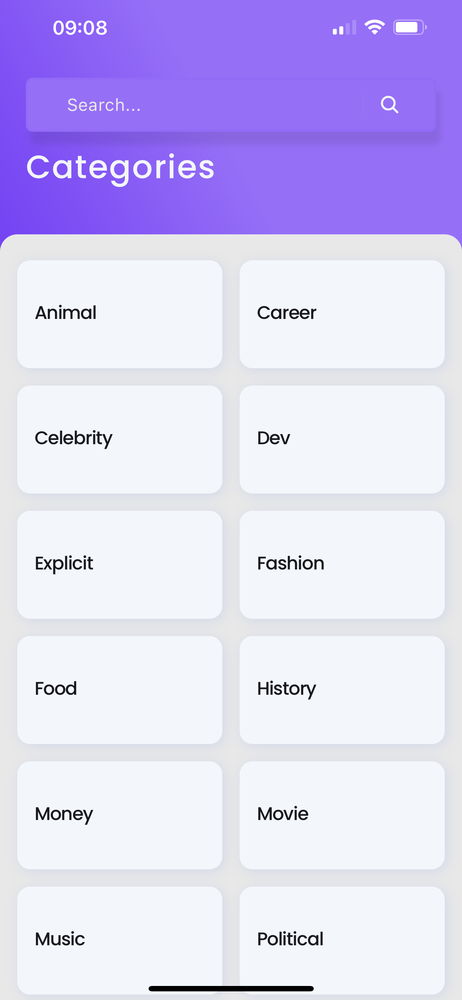

# INSTALLATION

## Prerequisites

1. [NodeJs](https://nodejs.org/en/download/) version 16
2. [Yarn](https://yarnpkg.com/getting-started) version >=1.22.19
3. [Expo CLI](https://docs.expo.dev/workflow/expo-cli/)
4. [Git](https://git-scm.com) SCM
5. [Expo Go](https://expo.dev/client) Client

## Setup

clone the project with [git](https://git-scm.com) to your preferred location on your local computer.

```bash
    # using ssh
    git clone git@github.com:cephaske254/brilliant-sov.git
    # or using https
    git clone https://github.com/cephaske254/brilliant-sov
```

Navigate to the project root and install dependencies with [yarn](https://yarnpkg.com/getting-started).

```bash
    cd brilliant-sov
    yarn
```

Start Metro bunder

```bash
    yarn start
```

Launch [Expo Go](https://expo.dev/client) on your Android/iOS phone, and follow the instructions on how to launch the app.

## Folder Structure

```
├── api
├── assets
│   ├── fonts
│   └── icons
├── components
│   └── empty-states
├── contexts
├── hooks
├── screens
├── store
│   ├── selectors
│   ├── slices
│   └── thunks
└── theme
```

## Screenshots

### Home Screen



### Quote Detail View


### Quote Not Found


### Search Results


### Search Result Not Found


